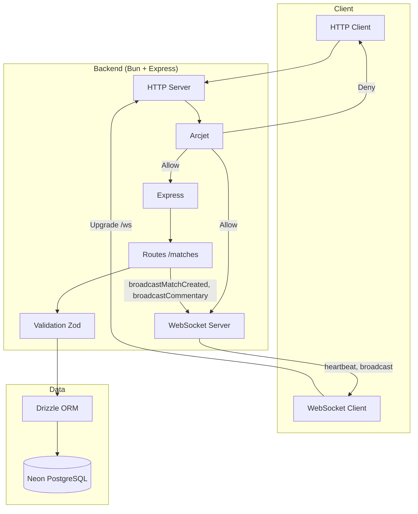
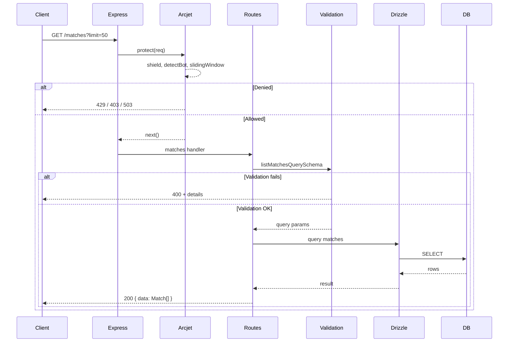
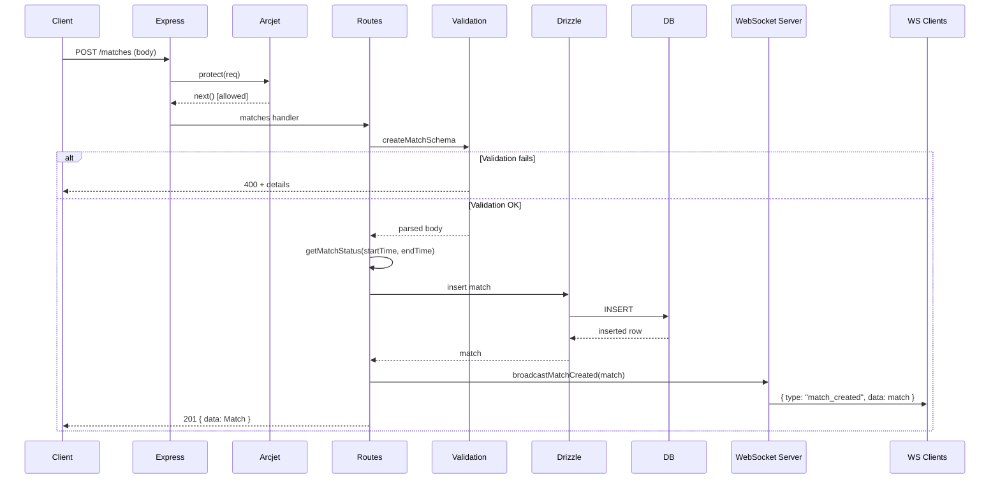
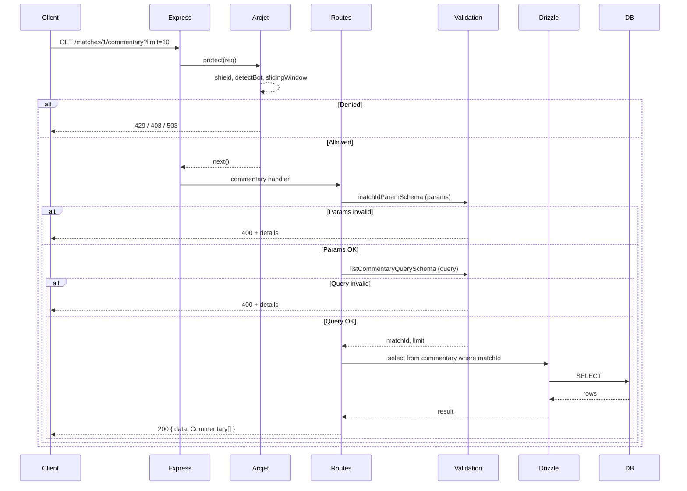
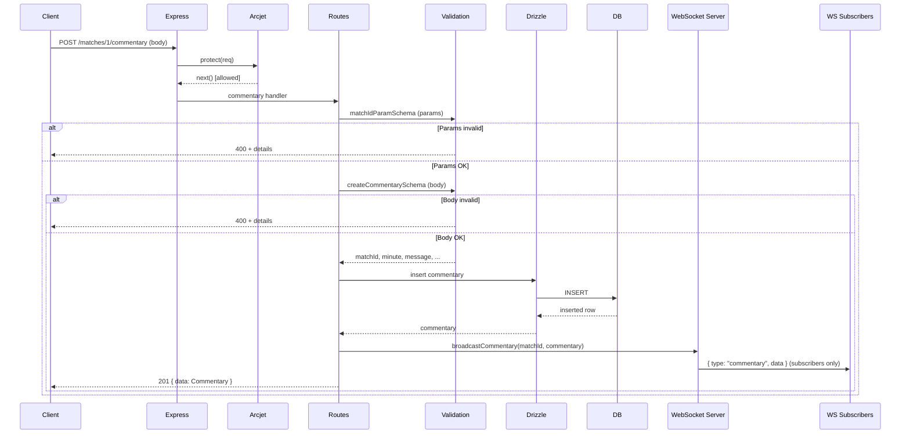
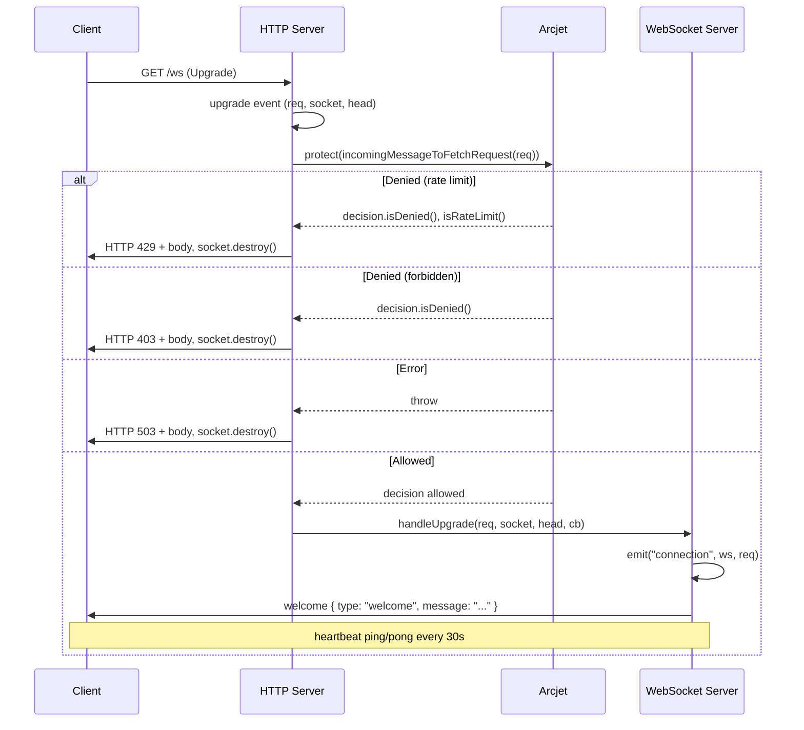
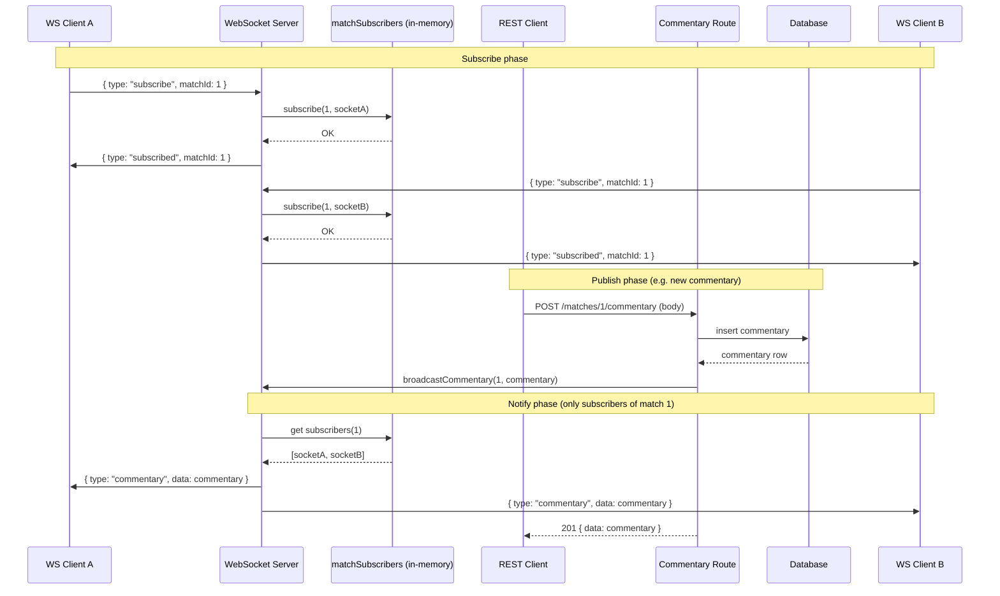

# SportsBuzz Backend

REST API and WebSocket backend for the SportsBuzz live feed application. Built with **Bun**, **Express**, **TypeScript**, **Drizzle ORM**, and **PostgreSQL** (Neon). Manages matches and match status (scheduled / live / finished), match commentary, real-time updates over WebSocket (subscribe by match, broadcasts for new matches and commentary), and protection via **Arcjet** (shield, bot detection, rate limiting).

---

## Tech Stack

| Layer        | Technology                          |
| ------------ | ----------------------------------- |
| Runtime      | [Bun](https://bun.sh)               |
| Framework    | Express 5                           |
| Language     | TypeScript (ESM)                    |
| Database     | PostgreSQL (Neon serverless)        |
| ORM          | Drizzle ORM                         |
| Validation   | Zod                                 |
| Real-time    | WebSocket (`ws`, path `/ws`)        |
| Security     | [Arcjet](https://arcjet.com) (shield, detectBot, slidingWindow) |
| Config       | dotenv (`PORT`, `HOST`, `DATABASE_URL`, `ARCJET_*`) |

---

## Architecture

High-level flow: **Client → HTTP/WS → Arcjet (optional) → Express / WebSocket → Routes (/matches, /matches/:id/commentary) or WS handler (subscribe, broadcast) → Validation → Drizzle → Neon PostgreSQL**.

### Architecture Diagram



### Architecture Flow (Textual)

- **HTTP:** Client requests hit Express. Arcjet middleware runs first (rate limit, bot/shield); denied requests get 429/403/503. Valid requests go to routes (/matches, /matches/:id/commentary); handlers validate input (Zod), use Drizzle, return JSON. POST handlers may broadcast to WebSocket clients via `app.locals`.
- **WebSocket:** Upgrade requests are handled by the HTTP server’s `upgrade` event. Arcjet protects the upgrade (same rules, different limits); denied clients get an HTTP error and the socket is destroyed. Accepted clients complete the handshake; the WS server handles heartbeat, welcome message, subscribe/unsubscribe by match, and broadcasts (`match_created` to all, `commentary` to subscribers only).
- Drizzle ORM talks to Neon PostgreSQL for persistence.

**Layer responsibilities:**

- **Express** — HTTP server, JSON body parsing, route mounting, `securityMiddleware()` (Arcjet).
- **Arcjet** — `src/arcjet.ts`: HTTP middleware (Express req → Fetch Request) and WS protection in server `upgrade` (IncomingMessage → Fetch Request). Rules: shield, detectBot, slidingWindow (HTTP: 50/10s; WS: 5/2s).
- **WebSocket** — `src/ws/server.ts`: `attachWebSocketServer(server)` uses `noServer: true`, handles `server.on("upgrade")`, then `handleUpgrade` and `connection` (heartbeat, welcome, subscribe/unsubscribe by match, `broadcastMatchCreated` and `broadcastCommentary` via `app.locals`).
- **Routes** — Request handling; validate (Zod), DB (Drizzle), response; POST /matches calls `req.app.locals.broadcastMatchCreated(match)`; POST /matches/:id/commentary calls `req.app.locals.broadcastCommentary(matchId, commentary)`.
- **Validation** — Query and body schemas for matches (limit, sport, teams, times, scores) and commentary (limit, minute, message, etc.).
- **Utils** — `getMatchStatus(startTime, endTime)` → `scheduled` | `live` | `finished`.
- **DB** — Drizzle + Neon serverless pool; schema: `matches`, `commentary` (relations defined).

---

## Sequence: List Matches (GET /matches)



1. Client sends `GET /matches?limit=50`
2. Express routes request to the matches handler.
3. The query object is validated with `listMatchesQuerySchema`.
   - **If validation fails**: Return HTTP 400 with error details.
   - **If validation succeeds**: Continue.
4. Drizzle ORM queries the `matches` table, ordering by `createdAt` descending and applying a limit.
5. Results are returned as `{ data: result }` with HTTP 200.

---

## Sequence: Create Match (POST /matches)



1. Client sends `POST /matches` with `{ sport, homeTeam, awayTeam, startTime, endTime, ... }`
2. Express routes request to the matches handler.
3. The request body is validated with `createMatchSchema`.
   - **If validation fails**: Return HTTP 400 with error details.
   - **If validation succeeds**: Continue.
4. The `getMatchStatus` util determines match status (`scheduled`/`live`/`finished`) based on times.
5. Drizzle ORM inserts the new match record into the DB and returns the inserted row(s).
   - **If DB error**: Return HTTP 500 with error details.
   - **If success**: Return `{ data: insertedMatch }` with HTTP 201; optionally broadcast to WebSocket clients via `broadcastMatchCreated(match)`.

---

## Sequence: List Commentary (GET /matches/:id/commentary)



1. Client sends `GET /matches/:id/commentary?limit=10` (path param `id` = match ID).
2. Express routes request to the commentary handler (mounted at `/matches/:id/commentary`).
3. Path params are validated with `matchIdParamSchema`; query with `listCommentaryQuerySchema`.
   - **If validation fails**: Return HTTP 400 with error details.
   - **If validation succeeds**: Continue.
4. Drizzle ORM queries the `commentary` table filtered by `matchId`, ordered by `createdAt` descending, with limit (default 10, max 100).
5. Results are returned as `{ data: Commentary[] }` with HTTP 200.

---

## Sequence: Create Commentary (POST /matches/:id/commentary)



1. Client sends `POST /matches/:id/commentary` with body `{ minute, message, ... }` (path param `id` = match ID).
2. Express routes request to the commentary handler.
3. Path params are validated with `matchIdParamSchema`; body with `createCommentarySchema` (e.g. `minute`, `message` required).
   - **If validation fails**: Return HTTP 400 with error details.
   - **If validation succeeds**: Continue.
4. Drizzle ORM inserts the commentary row and returns the inserted record.
5. Route calls `req.app.locals.broadcastCommentary(matchId, commentary)` so only WebSocket clients subscribed to that match receive `{ type: "commentary", data }`.
6. Response is `{ data: Commentary }` with HTTP 201.

---

## Project Structure

```
backend/
├── src/
│   ├── index.ts              # Express app, HTTP server, health, /matches, /matches/:id/commentary, Arcjet, attachWebSocketServer
│   ├── arcjet.ts             # Arcjet (HTTP + WS), expressReqToFetchRequest, incomingMessageToFetchRequest
│   ├── routes/
│   │   ├── matches.ts        # GET / and POST / for matches
│   │   └── commentary.ts    # GET / and POST / for match commentary (mounted at /matches/:id/commentary)
│   ├── ws/
│   │   └── server.ts         # WebSocket server (upgrade, Arcjet, heartbeat, subscribe/unsubscribe, broadcastMatchCreated, broadcastCommentary)
│   ├── db/
│   │   ├── db.ts             # Neon pool + Drizzle instance
│   │   └── schema.ts         # matches, commentary tables, relations, types
│   ├── validations/
│   │   ├── matches.ts        # Zod schemas (list query, create body, etc.)
│   │   └── commentary.ts    # Zod schemas (list query, create body, match id param)
│   └── utils/
│       └── matchStatus.ts    # getMatchStatus, syncMatchStatus
│   ├── services/
│   │   └── liveFeedService.ts # Background job: auto-commentary, auto-scores, auto-spawner
│   ├── data/
│   │   └── data.json        # Seed data (matches + commentary feed)
│   └── seed.js              # Seed script (POSTs to API; requires API_URL, server running)
├── drizzle.config.ts        # Drizzle Kit config (schema, migrations out dir)
├── package.json
├── tsconfig.json
└── README.md
```

---

## Environment Variables

| Variable                       | Required | Description                                                                 |
| ------------------------------ | -------- | --------------------------------------------------------------------------- |
| `DATABASE_URL`                 | Yes      | Neon PostgreSQL connection string                                           |
| `ARCJET_API_KEY`               | Yes      | Arcjet API key (shield, bot detection, rate limiting)                        |
| `API_URL`                      | Yes*     | Base URL of the running API (e.g. `http://localhost:8000`) for `bun run seed` |
| `PORT`                         | No       | Server port (default: `8000`)                                               |
| `HOST`                         | No       | Bind address (default: `0.0.0.0`)                                           |
| `ARCJET_ENV`                   | No       | `DRY_RUN` to log only, or `LIVE` (default) to enforce                        |
| `DELAY_MS`                     | No       | Delay in ms between commentary posts when seeding (default: `250`)         |
| `SEED_MATCH_DURATION_MINUTES`  | No       | Match duration in minutes for seed (default: `120`)                          |
| `SEED_FORCE_LIVE`              | No       | Set to `1` or `true` to treat seed matches as live                          |

\* `API_URL` is required only when running `bun run seed`. Create a `.env` in the project root (see `.env.example` if present). **Do not commit real credentials.**

---

## Setup & Run

**Install dependencies:**

```bash
bun install
```

**Run in development (watch mode):**

```bash
bun run dev
```

**Run production:**

```bash
bun run start
```

**Build (output in `dist/`):**

```bash
bun run build
```

**Database (Drizzle):**

```bash
bun run db:generate   # generate migrations from schema
bun run db:migrate    # run migrations
bun run db:studio     # open Drizzle Studio
```

**Seed data (from `src/data/data.json`):**

The seed script creates matches and posts commentary via the REST API. **The server must be running** (e.g. in another terminal: `bun run dev`). Set `API_URL` in `.env` to the server base URL (e.g. `http://localhost:8000`).

```bash
bun run seed
```

Optional env vars: `DELAY_MS` (delay between commentary posts, default `250`), `SEED_MATCH_DURATION_MINUTES` (default `120`), `SEED_FORCE_LIVE` (treat matches as live when `1`/`true`).

Server listens on `HOST:PORT` (default `0.0.0.0:8000`). Health check: `GET http://localhost:8000/health` → `200 OK`. WebSocket: `ws://localhost:8000/ws`.

---

## WebSocket

### WebSocket connection sequence



### WebSocket pub/sub sequence (subscribe → publish → notify)

Commentary uses a pub/sub model: clients subscribe to a match by `matchId`; when commentary is published (via POST /matches/:id/commentary), only subscribers of that match receive the event.



- **Subscribe:** Client sends `{ type: "subscribe", matchId }`; server adds the socket to an in-memory map `matchId → Set<WebSocket>` and replies `{ type: "subscribed", matchId }`.
- **Publish:** Any client (or server) creates commentary via POST /matches/:id/commentary; the route persists to the DB and calls `broadcastCommentary(matchId, commentary)`.
- **Notify:** The WebSocket server looks up subscribers for that `matchId` and sends `{ type: "commentary", data }` only to those sockets. Unsubscribed clients do not receive the event.

- **Endpoint:** `ws://<host>:<port>/ws`
- **Upgrade:** Protection runs in the HTTP server `upgrade` handler (before handshake). Denied requests receive an HTTP error (429 rate limit, 403 forbidden, 503 on error) and the socket is destroyed.
- **After connect:** Server sends a welcome message `{ type: "welcome", message: "..." }`. Heartbeat (ping/pong) every 30s; unresponsive clients are terminated.
- **Subscribe / Unsubscribe:** Clients send JSON messages to receive match-specific events:
  - `{ type: "subscribe", matchId: number }` — subscribe to a match; server replies `{ type: "subscribed", matchId }`.
  - `{ type: "unsubscribe", matchId: number }` — unsubscribe; server replies `{ type: "unsubscribed", matchId }`.
- **Broadcasts:**
  - **Match created:** When a match is created via POST /matches, the server calls `req.app.locals.broadcastMatchCreated(match)` → all clients receive `{ type: "match_created", data: match }`.
  - **Commentary:** When commentary is added via POST /matches/:id/commentary, the server calls `req.app.locals.broadcastCommentary(matchId, commentary)` → only clients subscribed to that match receive `{ type: "commentary", data: commentary }`.

---

## API Summary

| Method | Path                       | Description                    | Validation / Behavior                            |
| ------ | -------------------------- | ------------------------------ | ------------------------------------------------ |
| GET    | `/health`                  | Liveness check                 | —                                                |
| GET    | `/matches`                 | List matches (newest first)    | Query: `limit` (optional, max 100, default 50)   |
| POST   | `/matches`                 | Create a match                 | Body: `sport`, `homeTeam`, `awayTeam`, `startTime`, `endTime` (ISO); optional `homeScore`, `awayScore`. `endTime` must be after `startTime`. Status derived automatically. |
| GET    | `/matches/:id/commentary`  | List commentary for a match   | Params: `id` (match ID). Query: `limit` (optional, max 100, default 10). |
| POST   | `/matches/:id/commentary`  | Add commentary for a match    | Params: `id` (match ID). Body: `minute` (int), `message` (required); optional `sequence`, `period`, `eventType`, `actor`, `team`, `metadata`, `tags`. |

**List matches:** `200` → `{ data: Match[] }`  
**Create match:** `201` → `{ data: Match }`  
**List commentary:** `200` → `{ data: Commentary[] }`  
**Create commentary:** `201` → `{ data: Commentary }` (and broadcast to subscribed WebSocket clients).  
**Errors:** `400` (validation) with `error` and `details`; `429` (rate limit), `403` (Arcjet denied), `503` (Arcjet/upstream error); `500` (server) with `error` and `details`.

---

## Database Schema (conceptual)

- **matches** — `id`, `sport`, `home_team`, `away_team`, `status` (enum: scheduled | live | finished), `start_time`, `end_time`, `home_score`, `away_score`, `created_at`.
- **commentary** — `id`, `match_id` (FK → matches, onDelete cascade), `minute`, `sequence`, `period`, `event_type`, `actor`, `team`, `message`, `metadata` (jsonb), `tags` (array), `created_at`.
- Relations: matches → many commentary; commentary → one match.

Schema and types are defined in `src/db/schema.ts`; run `db:generate` and `db:migrate` to apply.

---

## Match Status Logic

`getMatchStatus(startTime, endTime, now?)`:

- If `now < startTime`: **scheduled**
- If `now >= endTime`: **finished**
- Otherwise: **live**

Used during match creation to set `status`. `syncMatchStatus` can be used for background status updates if needed.

---

## Background Services (**LiveFeedService**)

The backend includes a robust background service (`src/services/liveFeedService.ts`) that runs using `node-cron`. This service ensures the platform feels "alive" without manual intervention.

### 1. Automatic Commentary & Scores
- **Interval**: Runs every 30 seconds.
- **Behavior**: For every match currently marked as `live`, the system has a ~35% chance to generate a sport-specific event (Goal, Wicket, Three-pointer, etc.).
- **Real-time**: Every generated event is persisted to the DB and broadcasted instantly to all connected WebSocket clients.

### 2. Automatic Match Spawner
- **Interval**: Runs every 5 minutes.
- **Behavior**: If there are fewer than 3 `live` matches in the database, the system randomly selects a sport and two teams from its internal pool and spawns a **brand new match**.
- **Cycle**: New matches are scheduled to last 2 hours (Football/Basketball) or 8 hours (Cricket) and will automatically transition to `finished` when their time is up.

---

## Deployment Guide (Render)

1. **Setup**: Connect your GitHub repository to [Render](https://render.com/).
2. **Environment**:
   - **Build Command**: `bun install && bun run build`
   - **Start Command**: `bun run start` (Starts the optimized `dist/index.js` bundle).
3. **Environment Variables**:
   - `DATABASE_URL`: Your Neon PostgreSQL connection string.
   - `ARCJET_API_KEY`: Your Arcjet security key.
   - `FRONTEND_URL`: The URL of your deployed frontend (e.g., `https://your-app.vercel.app`).
   - `API_URL`: The base URL of your Render service.
