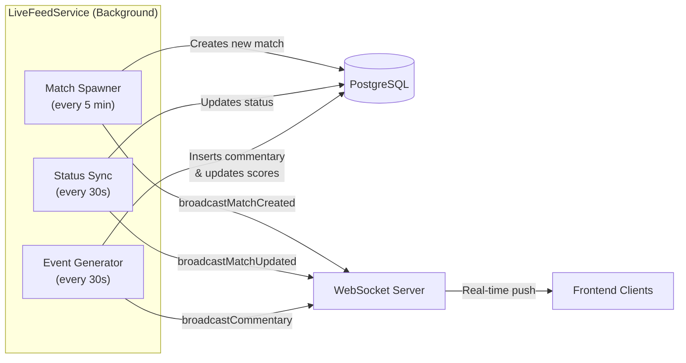

# 🏟️ SportsBuzz — Real-time Sports Intelligence

**SportsBuzz** is a full-stack, real-time sports dashboard that delivers live match commentary, scores, and match events as they happen. It features an autonomous backend that continuously generates matches and events, a responsive neobrutalist frontend, and instant updates via WebSockets.

> **Live Demo:** [https://sportsbuzzz.vercel.app](https://sportsbuzzz.vercel.app)

---

## ✨ Features

- **🔴 Live Commentary Feed** — Ball-by-ball, play-by-play updates streamed in real time via WebSockets.
- **⚽🏏🏀 Multi-Sport Support** — Football, Cricket, and Basketball with sport-specific events (goals, wickets, three-pointers, etc.).
- **🤖 Autonomous Live Feed** — A background service automatically spawns new matches, generates commentary, updates scores, and transitions match statuses — zero manual intervention required.
- **📊 Live Score Tracking** — Scores update instantly as events are generated (goals, runs, baskets).
- **🌗 Dark / Light Mode** — Full theme support with smooth transitions.
- **📱 Responsive Design** — Neobrutalist UI that works seamlessly on desktop and mobile with a slide-up commentary drawer.
- **🛡️ Security** — Rate limiting, bot detection, and shield protection via [Arcjet](https://arcjet.com).
- **⚡ Blazing Fast** — Built on [Bun](https://bun.sh) runtime for maximum performance.

---

## 🏗️ Architecture

```
┌─────────────────────┐         WebSocket (wss://)         ┌──────────────────────┐
│                     │ ◄──────────────────────────────────►│                      │
│   Frontend (React)  │                                     │   Backend (Express)  │
│   Vercel            │ ────── REST API (https://) ────────►│   Render             │
│                     │                                     │                      │
└─────────────────────┘                                     └──────────┬───────────┘
                                                                       │
                                                            ┌──────────▼───────────┐
                                                            │   PostgreSQL (Neon)   │
                                                            │   Serverless DB       │
                                                            └──────────────────────┘
```

### How the Live Feed Works



1. **Match Spawner** — Every 5 minutes, checks if there are fewer than 3 live matches. If so, randomly picks a sport and two teams and creates a new live match.
2. **Status Sync** — Every 30 seconds, checks all non-finished matches and transitions them (`scheduled → live → finished`) based on their `startTime` and `endTime`.
3. **Event Generator** — Every 30 seconds, generates sport-specific events for live matches (~35% chance per match per tick), updates scores, and persists commentary to the database.

All events are instantly broadcast to connected WebSocket clients.

---

## 🛠️ Tech Stack

### Frontend
| Technology | Purpose |
| :--- | :--- |
| [React 19](https://react.dev) | UI framework |
| [TypeScript](https://typescriptlang.org) | Type safety |
| [Vite 7](https://vite.dev) | Build tool & dev server |
| [TailwindCSS 4](https://tailwindcss.com) | Styling |
| [Framer Motion](https://motion.dev) | Animations |
| [Zustand](https://zustand.docs.pmnd.rs) | State management |
| [TanStack Query](https://tanstack.com/query) | Data fetching & caching |
| [Sonner](https://sonner.emilkowal.dev) | Toast notifications |
| [Lucide React](https://lucide.dev) | Icons |

### Backend
| Technology | Purpose |
| :--- | :--- |
| [Bun](https://bun.sh) | Runtime |
| [Express 5](https://expressjs.com) | HTTP framework |
| [TypeScript](https://typescriptlang.org) | Type safety |
| [Drizzle ORM](https://orm.drizzle.team) | Database ORM |
| [Neon PostgreSQL](https://neon.tech) | Serverless database |
| [ws](https://github.com/websockets/ws) | WebSocket server |
| [node-cron](https://github.com/node-cron/node-cron) | Background job scheduling |
| [Zod](https://zod.dev) | Request validation |
| [Arcjet](https://arcjet.com) | Security (rate limiting, bot detection, shield) |

---

## 📁 Project Structure

```
sportsbuzz/
├── frontend/                   # React + Vite frontend
│   ├── src/
│   │   ├── components/
│   │   │   ├── layout/         # Header, navigation
│   │   │   ├── matches/        # MatchCard, CommentarySidebar, NewMatchBanner
│   │   │   └── ui/             # Reusable UI primitives
│   │   ├── hooks/              # useMatches, useCommentary, useWebSocket
│   │   ├── lib/                # WebSocket client (ws.ts)
│   │   ├── store/              # Zustand store (useSportsStore)
│   │   ├── context/            # ThemeContext
│   │   ├── types/              # TypeScript type definitions
│   │   ├── config.ts           # API & WS URL configuration
│   │   └── App.tsx             # Root component
│   ├── vercel.json             # Vercel SPA routing config
│   └── package.json
│
├── backend/                    # Express + Bun backend
│   ├── src/
│   │   ├── routes/
│   │   │   ├── matches.ts      # GET/POST /matches
│   │   │   └── commentary.ts   # GET/POST /matches/:id/commentary
│   │   ├── ws/
│   │   │   └── server.ts       # WebSocket server (subscribe, broadcast, heartbeat)
│   │   ├── services/
│   │   │   └── liveFeedService.ts  # Background: auto-commentary, auto-scores, match spawner
│   │   ├── db/
│   │   │   ├── db.ts           # Neon pool + Drizzle instance
│   │   │   └── schema.ts       # matches & commentary tables, relations, types
│   │   ├── validations/        # Zod schemas for request validation
│   │   ├── utils/
│   │   │   └── matchStatus.ts  # getMatchStatus helper
│   │   ├── arcjet.ts           # Arcjet security configuration
│   │   ├── data/data.json      # Seed data
│   │   ├── seed.js             # Database seeding script
│   │   └── index.ts            # Server entry point
│   ├── render.yaml             # Render deployment config
│   └── package.json
│
└── readme.md                   # ← You are here
```

---

## 🚀 Getting Started

### Prerequisites

- [Bun](https://bun.sh) (v1.0+)
- [Node.js](https://nodejs.org) (v18+ as fallback)
- A [Neon](https://neon.tech) PostgreSQL database
- An [Arcjet](https://arcjet.com) API key

### 1. Clone the repository

```bash
git clone https://github.com/ShivamH1/SportsBuzz.git
cd SportsBuzz
```

### 2. Setup Backend

```bash
cd backend
bun install
```

Create a `.env` file:

```env
PORT=8000
HOST=0.0.0.0
DATABASE_URL=postgresql://...your-neon-connection-string...
ARCJET_API_KEY=your_arcjet_key
ARCJET_ENV=development
API_URL=http://localhost:8000
FRONTEND_URL=http://localhost:5173
```

Run database migrations and start:

```bash
bun run db:generate
bun run db:migrate
bun run dev
```

### 3. Seed initial data (optional)

In a separate terminal (backend must be running):

```bash
cd backend
bun run seed
```

### 4. Setup Frontend

```bash
cd frontend
bun install
```

Create a `.env` file:

```env
VITE_API_URL=http://localhost:8000
VITE_WS_URL=ws://localhost:8000/ws
```

Start the dev server:

```bash
bun run dev
```

Open [http://localhost:5173](http://localhost:5173) — you should see live matches with commentary streaming in! 🎉

---

## 🌐 Deployment

### Frontend → Vercel

1. Import your GitHub repository on [Vercel](https://vercel.com).
2. Set **Root Directory** to `frontend`.
3. Set **Build Command** to `bun run build` (or `npm run build`).
4. Set **Output Directory** to `dist`.
5. Add environment variables:

| Variable | Value |
| :--- | :--- |
| `VITE_API_URL` | `https://your-backend.onrender.com` |
| `VITE_WS_URL` | `wss://your-backend.onrender.com/ws` |

### Backend → Render

1. Connect your GitHub repository on [Render](https://render.com).
2. Create a **Web Service** with these settings:
   - **Build Command**: `bun install && bun run build`
   - **Start Command**: `bun run start`
3. Add environment variables:

| Variable | Value |
| :--- | :--- |
| `PORT` | `10000` |
| `HOST` | `0.0.0.0` |
| `DATABASE_URL` | Your Neon connection string |
| `ARCJET_API_KEY` | Your Arcjet key |
| `ARCJET_ENV` | `LIVE` |
| `FRONTEND_URL` | `https://your-frontend.vercel.app` |

> **Note:** Use `wss://` (not `ws://`) for WebSocket URLs in production since Render serves over HTTPS.

---

## 📡 API Reference

| Method | Endpoint | Description |
| :--- | :--- | :--- |
| `GET` | `/health` | Health check |
| `GET` | `/matches` | List all matches (newest first) |
| `POST` | `/matches` | Create a new match |
| `GET` | `/matches/:id/commentary` | Get commentary for a match |
| `POST` | `/matches/:id/commentary` | Add commentary to a match |

### WebSocket Events

| Direction | Event | Description |
| :--- | :--- | :--- |
| Client → Server | `{ type: "subscribe", matchId }` | Subscribe to a match's live feed |
| Client → Server | `{ type: "unsubscribe", matchId }` | Unsubscribe from a match |
| Server → Client | `{ type: "welcome" }` | Connection established |
| Server → Client | `{ type: "match_created", data }` | New match created (broadcast to all) |
| Server → Client | `{ type: "match_updated", data }` | Match status/score updated (broadcast to all) |
| Server → Client | `{ type: "commentary", data }` | New commentary entry (subscribers only) |

---

## 🧠 Background Services

The `LiveFeedService` makes the platform fully autonomous:

| Service | Interval | Behavior |
| :--- | :--- | :--- |
| **Match Spawner** | Every 5 min | Creates new matches if fewer than 3 are live |
| **Status Sync** | Every 30s | Transitions matches: `scheduled → live → finished` |
| **Event Generator** | Every 30s | Generates sport-specific commentary & updates scores |

All three services run automatically on server start — no cron jobs or external schedulers needed.

---

## 📄 License

This project is open source and available under the [MIT License](LICENSE).

---

<p align="center">
  Built with ❤️ by <a href="https://github.com/ShivamH1">ShivamH1</a>
</p>
