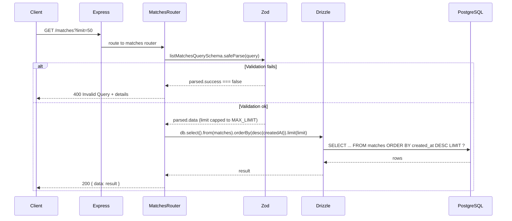

# SportsBuzz Backend

REST API backend for the SportsBuzz live feed application. Built with **Bun**, **Express**, **TypeScript**, **Drizzle ORM**, and **PostgreSQL** (Neon). Manages matches and match status (scheduled / live / finished).

---

## Tech Stack

| Layer        | Technology                          |
| ------------ | ----------------------------------- |
| Runtime      | [Bun](https://bun.sh)               |
| Framework    | Express 5                           |
| Language     | TypeScript (ESM)                    |
| Database     | PostgreSQL (Neon serverless)        |
| ORM          | Drizzle ORM                         |
| Validation   | Zod                                 |
| Config       | dotenv (`PORT`, `DATABASE_URL`)     |

---

## Architecture

High-level flow: **Client → Express → Routes → Validation → Drizzle → Neon PostgreSQL**.

```mermaid
flowchart TB
    subgraph Client
        HTTP[HTTP Client]
    end

    subgraph Backend["SportsBuzz Backend"]
        Express[Express App]
        Health[/health]
        MatchesRouter[/matches Router]

        subgraph MatchesFlow["/matches"]
            List[GET / - List Matches]
            Create[POST / - Create Match]
        end

        subgraph Validation
            ZodList[listMatchesQuerySchema]
            ZodCreate[createMatchSchema]
        end

        subgraph Utils
            MatchStatus[getMatchStatus]
        end

        subgraph Data["Data Layer"]
            Drizzle[Drizzle ORM]
        end
    end

    subgraph External["External"]
        Neon[(Neon PostgreSQL)]
    end

    HTTP --> Express
    Express --> Health
    Express --> MatchesRouter
    MatchesRouter --> List
    MatchesRouter --> Create
    List --> ZodList
    Create --> ZodCreate
    Create --> MatchStatus
    List --> Drizzle
    Create --> Drizzle
    Drizzle --> Neon
```

**Layer responsibilities:**

- **Express** — HTTP server, JSON body parsing, route mounting.
- **Routes** — Request handling; validate input (Zod), call DB, format response.
- **Validation** — Query and body schemas (limit, sport, teams, times, scores).
- **Utils** — `getMatchStatus(startTime, endTime)` → `scheduled` | `live` | `finished`.
- **DB** — Drizzle + Neon serverless pool; schema: `matches`, `commentary` (relations defined).

---

## Sequence Diagrams

### List matches (GET /matches)



### Create match (POST /matches)

```mermaid
sequenceDiagram
    participant Client
    participant Express
    participant MatchesRouter
    participant Zod
    participant MatchStatus
    participant Drizzle
    participant PostgreSQL

    Client->>Express: POST /matches { sport, homeTeam, awayTeam, startTime, endTime, ... }
    Express->>MatchesRouter: route to matches router

    MatchesRouter->>Zod: createMatchSchema.safeParse(body)
    alt Validation fails (e.g. endTime <= startTime)
        Zod-->>MatchesRouter: parsed.success === false
        MatchesRouter-->>Client: 400 Invalid Payload + details
    else Validation ok
        Zod-->>MatchesRouter: parsed.data
        MatchesRouter->>MatchStatus: getMatchStatus(startTime, endTime)
        MatchStatus-->>MatchesRouter: "scheduled" | "live" | "finished"

        MatchesRouter->>Drizzle: db.insert(matches).values({ ...rest, startTime, endTime, homeScore, awayScore, status }).returning()
        Drizzle->>PostgreSQL: INSERT INTO matches ... RETURNING *
        alt DB error
            PostgreSQL-->>Drizzle: error
            Drizzle-->>MatchesRouter: throw
            MatchesRouter-->>Client: 500 Internal Server Error
        else Success
            PostgreSQL-->>Drizzle: inserted row(s)
            Drizzle-->>MatchesRouter: result; event = result[0]
            MatchesRouter-->>Client: 201 { data: event }
        end
    end
```

---

## Project Structure

```
backend/
├── src/
│   ├── index.ts              # Express app, health check, mount /matches
│   ├── routes/
│   │   └── matches.ts        # GET / and POST / for matches
│   ├── db/
│   │   ├── db.ts             # Neon pool + Drizzle instance
│   │   └── schema.ts         # matches, commentary tables, relations, types
│   ├── validations/
│   │   └── matches.ts        # Zod schemas (list query, create body, etc.)
│   └── utils/
│       └── matchStatus.ts    # getMatchStatus, syncMatchStatus
├── drizzle.config.ts        # Drizzle Kit config (schema, migrations out dir)
├── package.json
├── tsconfig.json
└── README.md
```

---

## Environment Variables

| Variable        | Required | Description                          |
| --------------- | -------- | ------------------------------------ |
| `DATABASE_URL`  | Yes      | Neon PostgreSQL connection string   |
| `PORT`          | No       | Server port (default: `8000`)        |

Create a `.env` in the project root (see `.env.example` if present). **Do not commit real credentials.**

---

## Setup & Run

**Install dependencies:**

```bash
bun install
```

**Run in development (watch mode):**

```bash
bun run dev
```

**Run production:**

```bash
bun run start
```

**Build (output in `dist/`):**

```bash
bun run build
```

**Database (Drizzle):**

```bash
bun run db:generate   # generate migrations from schema
bun run db:migrate    # run migrations
bun run db:studio     # open Drizzle Studio
```

Server listens on `PORT` (default `8000`). Health check: `GET http://localhost:8000/health` → `200 OK`.

---

## API Summary

| Method | Path       | Description                    | Validation / Behavior                    |
| ------ | ---------- | ------------------------------ | ----------------------------------------- |
| GET    | `/health`  | Liveness check                 | —                                         |
| GET    | `/matches` | List matches (newest first)    | Query: `limit` (optional, max 100, default 50) |
| POST   | `/matches` | Create a match                 | Body: `sport`, `homeTeam`, `awayTeam`, `startTime`, `endTime` (ISO); optional `homeScore`, `awayScore`. `endTime` must be after `startTime`. Status derived from current time vs start/end. |

**List response:** `200` → `{ data: Match[] }`.  
**Create response:** `201` → `{ data: Match }`.  
**Errors:** `400` (validation) with `error` and `details`; `500` (server) with `error` and `details`.

---

## Database Schema (conceptual)

- **matches** — `id`, `sport`, `home_team`, `away_team`, `status` (enum: scheduled | live | finished), `start_time`, `end_time`, `home_score`, `away_score`, `created_at`.
- **commentary** — `id`, `match_id` (FK → matches, onDelete cascade), `minute`, `sequence`, `period`, `event_type`, `actor`, `team`, `message`, `metadata` (jsonb), `tags` (array), `created_at`.
- Relations: matches → many commentary; commentary → one match.

Schema and types are defined in `src/db/schema.ts`; run `db:generate` and `db:migrate` to apply.

---

## Match Status Logic

`getMatchStatus(startTime, endTime, now?)`:

- `now < startTime` → **scheduled**
- `now >= endTime` → **finished**
- Otherwise → **live**

Used on create to set `status`; `syncMatchStatus` is available for background updates if needed.
